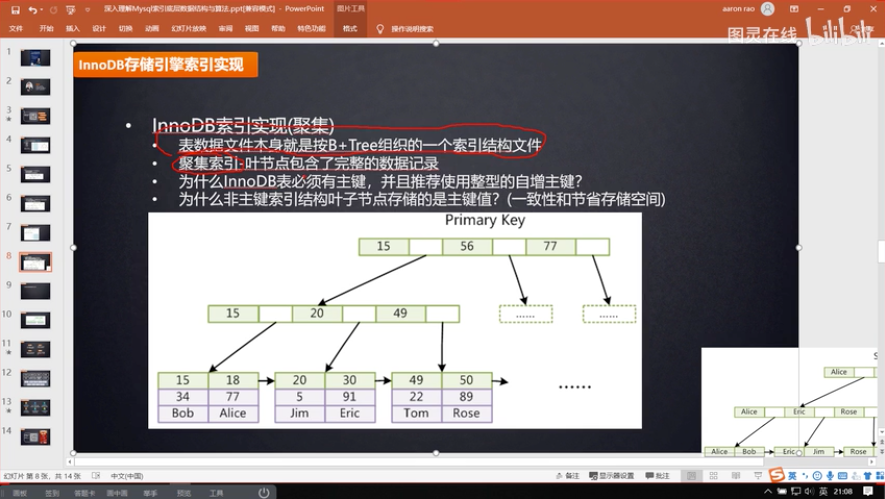
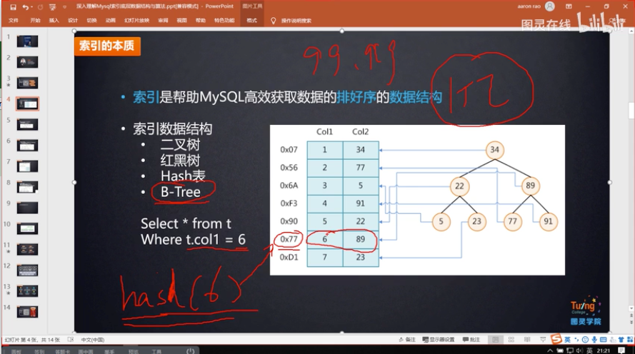
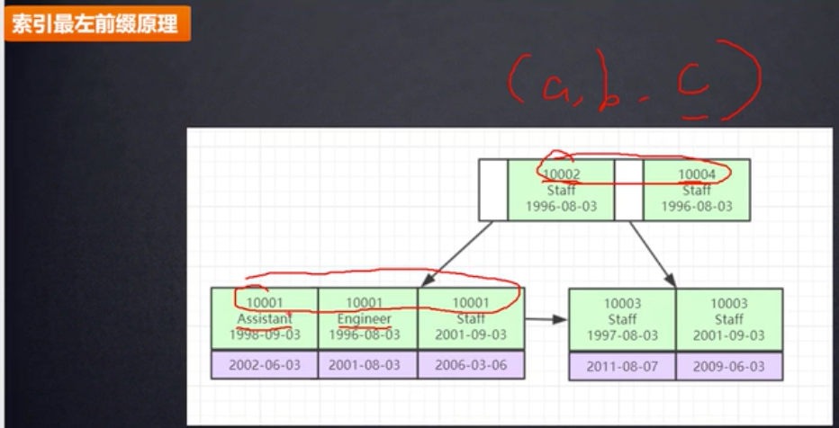
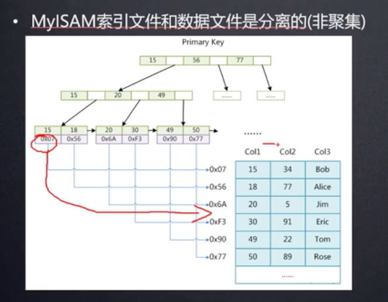

# MySQL存储引擎

**mysq存储引擎是形容表的**

## MyISAM存储引擎索引实现解析

在数据库的data文件夹中，存储着数据

引擎为MyISAM的某个数据库文件中，存在三个重要文件：

+ ***.frm**: 表结构信息

+ ***.MYD**:存储表中的数据行的记录

+ ***.MYI**:存储表中索引字段

  MyISAM索引的B+树结构中，叶子结点存储的是索引所在的磁盘文件的地址指针，查询时跨两个文件：索引文件与数据文件

  获取到文件指针后，经过回表操作从数据文件中（磁盘）拿到数据。

## innoDB存储引擎实现解析

引擎为InnoDB的某个数据库文件中，存在两个重要的文件：

+ ***.frm**: 表结构信息
+ ***.ibd**:索引+数据

Q：innodb表必须有主键，并且推荐使用整型的自增主键？

A：

Q：为什么推荐使用整型主键？

快+节省空间

比较【两个整型】还是比较 【两个字符串】快？

Q：为什么推荐使用自增主键？

等值查询下hash索引的确非常快，但不能解决范围查找

自增主键的B+树可以实现范围查找

Explain工具：查看是否使用了索引

